<!-- 
  ╔══════════════════════════════════════════════════════════════╗
  ║  SAKSHAM WADHANKAR — CYBERPUNK GITHUB PROFILE               ║
  ║  Cyber Security Student · AI Developer · Full Stack Dev     ║
  ║  Symbiosis Institute of Technology                          ║
  ╚══════════════════════════════════════════════════════════════╝
-->

<div align="center">

<!-- ═══════════════════════════════════════════════════════════════
     SECTION 1 — ASCII PORTRAIT + TERMINAL INFO PANEL
     ═══════════════════════════════════════════════════════════════ -->

```
                                        ,,,,,,::;;;1i1;:
                                .......,......,,,,,,,:;;;iii
                              ....     ...,,,,:,. ..,,,...,,;iiit1
                            ,.     .   .... .,. .  .,,,;,,.,:;::;;;ii
       .    ..          ..,...::.....,,. .......:i;
     . .            .,,..   ,,,. ...,,,:::,;i:::.:ii
    .                      .    ..,,..... ....,::,,;t1:
   ..         ,                   .,,,. .,:;;:,,,,::::iI
   .       ...                              .  ..  .:,;it
           ..           ..     .. .   ...   ,:.... .:i,:1t
         ...                . .:,.;.  ,,,,:::i:,:,,..:.:ii 1
         ..             .  ,.   . ...  .. .,.....,,,,,,,:iit
         .                          ..          ........,,,1
         .                  . .    .;,. ..        ..      ,;
        .             .      ,,:,,::;ti,...          ....::
                 ....,... ,1|!|lIIl!!+!|lt1;,..       ..,:.
        .    .    .,,,:,,;l+~~+++++~l1i;;;it|!lI1i;;. .,,,
        .. ,..,, ..,:;;;;t!~=~~=~!ltIlllti,  .:1I||Ii:.:,
    .:;;,.,,:,::;i!I;:;;iI+~==<<=+I1;;;11;...,,;tI;.,,
  .::. .i1:i;1;i;:t|I:,:il+~=<>*#>~+|1I=>I..:;t!|;,;t
  ,,.   .I1i:i,;:::lIi,:il!+~=<*##*><!t1i;itl|+>*~;,
  ;,.    :1.,..,,,i~+t:.:1l|!+=<>#MM#*>=++~<<<>>##*>
  ;i,    ::  ....:,t|t:..:1Il|!+=<**###*****><<<<**M#
  .::.  .;       .;II1,  .:itl|!+~=<*#MM#*>~!~<<<>#*W*
    .:;;,        ,|!t1:  .,:1tl|!+~=<>***>~|I+~!ll|~=~
                 ,:,;:....,,:i1tl!+==<>>><>=li1i:;;i
               .,:::,. ..,,:;;;itl!~~=<<=!lI1:,...,
             .,:i1i,   ..,::i;;iitI!+~~|;..,::,;t;,.
            .,:i1t1:    .,,:;;;;;itl!+|i.:i1tllt1,
            .:ii1tt;.     ...,,:i1ttIIttIlIt111tIt
            ,;ii1tt1:.       .,;11IItttIllI1:........
            ,;iiitIt;,.         .,,:;1I|!~~~!1i:     ...
            :i1i;1II1i:,..           ,:;i111i;;::.      .,
           .:iii;iIlltii;;:,.           ........,:,     ..;
               ..              ,:;ii;;tl|It1ttti:.                 .,,,,.    .:1
               ...        ..  .,;;;i;:1l||Itttllt;.   ..:;,        .,,,.    ,:::,
                ..  ..   ...  ,:;;i1;:il!|lIt11t;,,,:,,:;;,       .,,.... .,,,,,;1
            .    ..  ......   :ii;iti:;I|!|lI1;:;;i111ii1;        .,,...,:,,.,,,,:;
                 ...  .....    ;i;1It;;t|!lIIt111tIIIItt;      .......,,,,,.,,,...
                  ...  ....     :iIlti:1l!ltiii1IlllII1,      ......,,,,,..,.  ..,::
      .....        .,. .....    ,t|l1:il+|t1ttIl|Iti,       ..,..,,,,,...   .....,,,,::
   ..........       ........      ,i1;:I+|l|||ll1:          ...,,,,..   .....,,...,,,,,::
 ..............     ...,....           ,::::.               .,,::.     ..,...,,,.,,..,,,,::
................    .  .,,..                               .,. ,.     .,,...,,..,,,..,,,,,,,:
.. ................     ...                              .,..  ,....  .,,..,,...,,,..,,,,,,,,:
 ..  .... ..........    .,..                             ..    .,....  ,,..,....,,,...,,,.,,,,,
  .  ....  .........    ,,.                             :.     .,.... ..,,.... .,,....,,,,...,,
  .   ...  .........    .,.                            ,..    .,....  .,,,... .,,....,......,,,
      ...  .........     ,,                            ,....  .,....  .,....  .,...........,...
 .     ..  .........      ,.                          :.....  .,....  .,.... .... ............,
       ..   ........      ,.    .                     :.....  ......  .,...  ...  .... ........
  .     .   ..... .       ,.                         ,......  ......  .....  ..  ....  ..  ....
            ..... .       ,.                         :......  ...... ......  .   .    ..   ....
            ....          ,.                         :......  .....  .....   .             ....
            ....          ,.                         :...... ......  .....   .             .. .
             ..           ,                         ..... .  ......  ...                  .. .
             ..            .                        ..... .  .....   ...                 .
       .                        .....   ...      ..
       .                        ....     ..      ..
      .                         ....     .
      .                         ....     .
```

<br/>

```js
// ┌──────────────────────────────────────────┐
// │         neofetch — cyberlab v4.2         │
// └──────────────────────────────────────────┘

const saksham = {

  os       : "CyberOS v4.2 (Kali-based)",
  user     : "Saksham Wadhankar",
  shell    : "zsh 5.9 + oh-my-zsh",
  uptime   : "20+ years",

  role     : [
    "Cyber Security Student",
    "AI Developer",
    "Full Stack Developer"
  ],

  institute: "Symbiosis Institute of Technology",
  branch   : "CSE (Cyber Security)",

  languages: [
    "Python", "JavaScript", "C++",
    "TypeScript", "Bash", "SQL"
  ],

  sec_tools: [
    "Burp Suite", "Nmap", "Wireshark",
    "Metasploit", "Ghidra", "John"
  ],

  frameworks: [
    "React", "Next.js", "Node.js",
    "FastAPI", "TensorFlow", "PyTorch"
  ],

  mission  : "Hack → Build → Secure → Repeat",
  status   : "▶ ACTIVE",
  github   : "github.com/sakshamwadhankar"

};
```


<!-- ═══════════════════════════════════════════════════════════════
     SECTION 2 — ANIMATED CYBERPUNK BANNER
     ═══════════════════════════════════════════════════════════════ -->




<!-- ═══════════════════════════════════════════════════════════════
     SECTION 3 — TYPING ANIMATION
     ═══════════════════════════════════════════════════════════════ -->

<a href="https://git.io/typing-svg">
  
</a>

<br/>


</div>

<!-- ═══════════════════════════════════════════════════════════════
     SECTION 4 — ABOUT ME (TERMINAL COMMANDS)
     ═══════════════════════════════════════════════════════════════ -->

<h2>
  >-ABOUT_ME-00FF41?style=for-the-badge&labelColor=0D1117&color=00FF41" alt="About Me"/>
</h2>

```bash
┌──(saksham@cyberlab)-[~/about]
└─$ whoami
╔══════════════════════════════════════════════════════════════════════╗
║  Saksham Wadhankar                                                  ║
║  Cyber Security Student @ Symbiosis Institute of Technology         ║
║  CSE (Cyber Security) — Building secure systems by day,             ║
║  breaking them (ethically) by night.                                ║
╚══════════════════════════════════════════════════════════════════════╝

┌──(saksham@cyberlab)-[~/about]
└─$ ls skills/
📂 cyber-security/    📂 ai-ml/         📂 full-stack/
📂 cloud-infra/       📂 devops/        📂 linux-admin/
📁 hackathon-wins/    📁 projects/      📁 open-source/

┌──(saksham@cyberlab)-[~/about]
└─$ cat goals.txt
 ► Master offensive & defensive security
 ► Build AI-powered security tools
 ► Contribute to open source security projects
 ► Win more hackathons & CTFs
 ► Build production-grade applications that matter
 ► Never stop learning

┌──(saksham@cyberlab)-[~/about]
└─$ pwd
/home/saksham/journey-to-excellence

┌──(saksham@cyberlab)-[~/about]
└─$ uname -a
CyberOS 4.2.0-kali saksham 2024 x86_64 Hack/Build/Secure/Repeat

┌──(saksham@cyberlab)-[~/about]
└─$ echo $ACHIEVEMENTS
 ✦ 10+ Hackathons Participated
 ✦ 2 Hackathon Wins
 ✦ Production Ready Projects
 ✦ AI-Powered Applications
 ✦ Open Source Contributions

┌──(saksham@cyberlab)-[~/about]
└─$ █
```

<div align="center">

</div>

<!-- ═══════════════════════════════════════════════════════════════
     SECTION 5 — SKILLS
     ═══════════════════════════════════════════════════════════════ -->

<h2>
  >-TECH_ARSENAL-00E5FF?style=for-the-badge&labelColor=0D1117&color=00E5FF" alt="Tech Arsenal"/>
</h2>

<div align="center">

<table>
<tr>
<td width="50%" valign="top">

#### `⌬ PROGRAMMING`


</td>
<td width="50%" valign="top">

#### `⌬ FRONTEND`


</td>
</tr>
<tr>
<td width="50%" valign="top">

#### `⌬ BACKEND`


</td>
<td width="50%" valign="top">

#### `⌬ CYBER SECURITY`


</td>
</tr>
<tr>
<td width="50%" valign="top">

#### `⌬ CLOUD & DEVOPS`


</td>
<td width="50%" valign="top">

#### `⌬ AI / ML`


</td>
</tr>
</table>


</div>

<!-- ═══════════════════════════════════════════════════════════════
     SECTION 6 — FEATURED PROJECTS
     ═══════════════════════════════════════════════════════════════ -->

<h2>
  >-FEATURED_PROJECTS-00FF41?style=for-the-badge&labelColor=0D1117&color=00FF41" alt="Featured Projects"/>
</h2>

<div align="center">

<table>
<tr>
<td width="50%" valign="top">

<h3>🔒 CyberShield AI</h3>

```
┌─────────────────────────────────────┐
│  AI-Powered Threat Detection System │
│  Real-time network analysis with    │
│  machine learning anomaly detection │
│  and automated incident response.   │
├─────────────────────────────────────┤
│  Stack: Python · TensorFlow · Flask │
│  Status: ◉ Production Ready        │
└─────────────────────────────────────┘
```


</td>
<td width="50%" valign="top">

<h3>🤖 NeuralForge</h3>

```
┌─────────────────────────────────────┐
│  Full-Stack AI Application Builder  │
│  Drag-and-drop interface for        │
│  building & deploying ML models     │
│  with one-click deployment.         │
├─────────────────────────────────────┤
│  Stack: Next.js · FastAPI · Docker  │
│  Status: ◉ Production Ready        │
└─────────────────────────────────────┘
```


</td>
</tr>
<tr>
<td width="50%" valign="top">

<h3>🛡️ VulnScanner Pro</h3>

```
┌─────────────────────────────────────┐
│  Automated Vulnerability Scanner    │
│  Web application security testing   │
│  tool with OWASP Top 10 coverage    │
│  and detailed reporting.            │
├─────────────────────────────────────┤
│  Stack: Python · Nmap · Selenium    │
│  Status: ◉ Active Development      │
└─────────────────────────────────────┘
```


</td>
<td width="50%" valign="top">

<h3>⚡ HackDash</h3>

```
┌─────────────────────────────────────┐
│  Hackathon Project Dashboard        │
│  Real-time collaboration platform   │
│  for hackathon teams with live      │
│  code sharing & deployment.         │
├─────────────────────────────────────┤
│  Stack: React · Node.js · Socket.io │
│  Status: ◉ Production Ready        │
└─────────────────────────────────────┘
```


</td>
</tr>
</table>


</div>

<!-- ═══════════════════════════════════════════════════════════════
     SECTION 7 — GITHUB STATS
     ═══════════════════════════════════════════════════════════════ -->

<h2>
  >-SYSTEM_METRICS-00E5FF?style=for-the-badge&labelColor=0D1117&color=00E5FF" alt="System Metrics"/>
</h2>

<div align="center">

<table>
<tr>
<td width="50%" align="center">


</td>
<td width="50%" align="center">


</td>
</tr>
</table>

<br/>


<br/><br/>

<!-- Trophies -->


<br/><br/>

<!-- Contribution Snake -->
<picture>
  <source media="(prefers-color-scheme: dark)" srcset="https://raw.githubusercontent.com/sakshamwadhankar/sakshamwadhankar/output/github-snake-dark.svg" />
  <source media="(prefers-color-scheme: light)" srcset="https://raw.githubusercontent.com/sakshamwadhankar/sakshamwadhankar/output/github-snake.svg" />
  
</picture>

<br/>


</div>

<!-- ═══════════════════════════════════════════════════════════════
     SECTION 8 — TIMELINE
     ═══════════════════════════════════════════════════════════════ -->

<h2>
  >-MISSION_LOG-00FF41?style=for-the-badge&labelColor=0D1117&color=00FF41" alt="Mission Log"/>
</h2>

```
╔══════════════════════════════════════════════════════════════════════════╗
║                          ◉ MISSION LOG                                  ║
╠══════════════════════════════════════════════════════════════════════════╣
║                                                                          ║
║  ┌─ 🏆 HACKATHON OPERATIONS ──────────────────────────────────────────┐  ║
║  │                                                                     │  ║
║  │  [2024] ▸ 10+ Hackathons Participated                              │  ║
║  │  [2024] ▸ 2× Hackathon Champion 🏆                                │  ║
║  │  [2024] ▸ Built production-grade solutions under pressure          │  ║
║  │  [2024] ▸ Led cross-functional teams in 48hr sprints               │  ║
║  │                                                                     │  ║
║  └─────────────────────────────────────────────────────────────────────┘  ║
║                                                                          ║
║  ┌─ 🚀 PROJECT DEPLOYMENTS ───────────────────────────────────────────┐  ║
║  │                                                                     │  ║
║  │  [ACTIVE]  ▸ AI-Powered Security Tools                             │  ║
║  │  [ACTIVE]  ▸ Full Stack Web Applications                           │  ║
║  │  [ACTIVE]  ▸ Machine Learning Models                               │  ║
║  │  [ACTIVE]  ▸ Open Source Contributions                             │  ║
║  │                                                                     │  ║
║  └─────────────────────────────────────────────────────────────────────┘  ║
║                                                                          ║
║  ┌─ 📡 LEARNING ROADMAP ──────────────────────────────────────────────┐  ║
║  │                                                                     │  ║
║  │  [██████████████████████████░░░░] 80% — Advanced Pentesting        │  ║
║  │  [████████████████████████░░░░░░] 75% — Cloud Security (AWS)       │  ║
║  │  [██████████████████████░░░░░░░░] 70% — ML/AI Engineering          │  ║
║  │  [████████████████░░░░░░░░░░░░░░] 55% — Blockchain Security        │  ║
║  │  [████████████████████████████░░] 90% — Full Stack Development     │  ║
║  │                                                                     │  ║
║  └─────────────────────────────────────────────────────────────────────┘  ║
║                                                                          ║
╚══════════════════════════════════════════════════════════════════════════╝
```

<div align="center">

</div>

<!-- ═══════════════════════════════════════════════════════════════
     SECTION 9 — CONNECT
     ═══════════════════════════════════════════════════════════════ -->

<h2>
  >-ESTABLISH_CONNECTION-00E5FF?style=for-the-badge&labelColor=0D1117&color=00E5FF" alt="Connect"/>
</h2>

<div align="center">

```
┌──(saksham@cyberlab)-[~/connect]
└─$ ping --establish-connection --protocol=secure
```

<br/>

[](https://github.com/sakshamwadhankar)
&nbsp;
[](https://linkedin.com/in/sakshamwadhankar)
&nbsp;
[](https://saksham.dev)
&nbsp;
[](mailto:saksham@example.com)

<br/>

```
[✓] Connection established successfully.
[✓] Encryption: AES-256-GCM
[✓] Protocol: TLS 1.3
[✓] Status: Awaiting transmission...
```


</div>

<!-- ═══════════════════════════════════════════════════════════════
     SECTION 10 — TERMINAL QUOTE + FOOTER
     ═══════════════════════════════════════════════════════════════ -->

<div align="center">



<br/><br/>



<br/><br/>

<!-- Visitor Counter -->


<br/><br/>



<br/>

```
┌──(saksham@cyberlab)-[~]
└─$ echo "Thanks for visiting. Stay curious. Stay secure."
 
  "Thanks for visiting. Stay curious. Stay secure."
 
┌──(saksham@cyberlab)-[~]
└─$ exit
 
  Connection closed.
```

<br/>

<sub>
  <samp>
    ⟨ Crafted with 💚 by Saksham Wadhankar ⟩<br/>
    ⟨ Last Updated: July 2026 ⟩
  </samp>
</sub>

</div>

<!-- EOF -->
